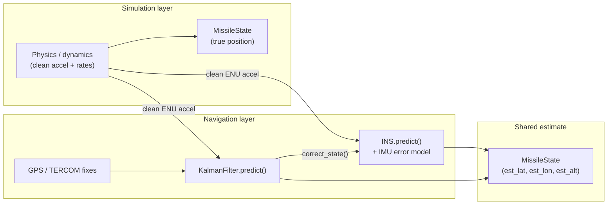

# Inertial Navigation System (INS)

This document explains how the `INS` class in `src/missile/navigation/ins.py` works, what each method does, and how it connects to the rest of the missile navigation stack.

---

## Table of contents

1. [What is the INS?](#what-is-the-ins)
2. [Role in the navigation stack](#role-in-the-navigation-stack)
3. [State variables and coordinate frames](#state-variables-and-coordinate-frames)
4. [What the INS expects as input](#what-the-ins-expects-as-input)
5. [IMU error model](#imu-error-model)
6. [Integration math inside `predict()`](#integration-math-inside-predict)
7. [Method reference](#method-reference)
8. [Factory helpers](#factory-helpers)
9. [Typical usage patterns](#typical-usage-patterns)
10. [Relationship to the Kalman filter](#relationship-to-the-kalman-filter)
11. [Design limits (what this INS is not)](#design-limits-what-this-ins-is-not)

---

## What is the INS?

An **Inertial Navigation System** estimates where the missile is by **dead reckoning**: it starts from a known position and velocity, then repeatedly integrates motion measurements from an **Inertial Measurement Unit (IMU)**.

In this project, the IMU provides:

| Sensor | Measures | Used for |
|--------|----------|----------|
| **Accelerometers** | Acceleration along three axes | Updating velocity and position |
| **Gyroscopes** | Angular rate (rotation speed) | Updating roll, pitch, and yaw |

Real IMUs are imperfect. Biases, drift, and noise cause the estimate to wander away from truth over time. That drift is intentional in this simulator: external sensors (GPS, TERCOM) and the Kalman filter correct it periodically.

With all error terms set to zero, the INS is a **clean, deterministic integrator** — useful for unit tests and debugging.

---

## Role in the navigation stack

The INS sits between **physics / simulation** (which produces IMU-like inputs) and **sensor fusion** (Kalman filter + GPS/TERCOM).



On each INS tick (typically 500 Hz), `NavigationComputer`:

1. Advances **ground truth** via `MissileState.update_physics()` using clean acceleration.
2. Advances the **INS estimate** via `ins.predict()` — the same clean acceleration, but corrupted inside the INS by the IMU error model.
3. Runs `KF.predict()` with the same acceleration input.
4. Copies the INS result into `MissileState` via `apply_ins_estimate()`.

When GPS or TERCOM delivers a fix, the Kalman filter updates, then pushes the corrected position/velocity back into the INS with `correct_state()`.

---

## State variables and coordinate frames

The INS tracks a **9-dimensional** inertial state (plus bookkeeping):

| Field | Shape | Units | Meaning |
|-------|-------|-------|---------|
| `pos[0]` | scalar | degrees | Latitude |
| `pos[1]` | scalar | degrees | Longitude |
| `pos[2]` | scalar | meters MSL | Altitude |
| `vel[0]` | scalar | m/s | East velocity |
| `vel[1]` | scalar | m/s | North velocity |
| `vel[2]` | scalar | m/s | Up velocity |
| `att[0]` | scalar | radians | Roll |
| `att[1]` | scalar | radians | Pitch |
| `att[2]` | scalar | radians | Yaw |
| `time` | scalar | seconds | Elapsed simulation time |
| `distance_traveled` | scalar | meters | Path length estimate |

### ENU velocity convention

Velocities use **ENU** (East–North–Up):

```
vel = [vx, vy, vz] = [east, north, up]
```

- **East** → positive longitude change
- **North** → positive latitude change
- **Up** → positive altitude change

This matches `MissileState.vel_east`, `vel_north`, `vel_up` and the Kalman filter's velocity components.

### Geographic position

Unlike the Kalman filter (which works internally in local ENU **meters**), the INS stores position as **geographic coordinates**:

```
pos = [lat, lon, alt]
```

Latitude and longitude are integrated in **degrees**, using WGS-84 scale factors from `terrain.coordinates`:

- `meter_per_deg_lat(lat)` — meters per degree of latitude
- `meter_per_deg_lon_at(lat)` — meters per degree of longitude at the current latitude

Altitude is integrated directly in **meters** (no degree conversion).

---

## What the INS expects as input

Each call to `predict()` takes:

| Argument | Frame | Meaning |
|----------|-------|---------|
| `acceleration` | **ENU nav frame** | `[a_east, a_north, a_up]` in m/s² |
| `angular_velocity` | Body Euler rates | `[roll_rate, pitch_rate, yaw_rate]` in rad/s |
| `dt` | — | Timestep in seconds |

### Important: simplified kinematic model

The class docstring refers to "specific force," but **`predict()` does not implement full strapdown INS mechanization**. Specifically, it does **not**:

- Rotate body-frame measurements into the navigation frame via a direction cosine matrix (DCM)
- Subtract gravity from accelerometer readings
- Use quaternions or a proper attitude kinematic chain

Instead, it treats `acceleration` as **already-expressed ENU kinematic acceleration** and integrates it directly:

```python
self.vel += acc * dt
self.att += ang_vel * dt
```

This is a deliberate simplification that matches how the rest of the stack (`MissileState.update_physics`, `KalmanFilter.predict`) consumes acceleration. Physics/dynamics modules should output **clean ENU kinematic acceleration** at the boundary; the INS adds sensor errors on top.

---

## IMU error model

Sensor imperfections are modeled inside `_corrupt_imu()` and applied on every `predict()` step. Three error types are supported:

### 1. Turn-on bias (constant)

Fixed offsets present from power-up, one per accelerometer/gyro axis:

```
measured = true + bias
```

- `accel_bias` — m/s² per axis (east, north, up)
- `gyro_bias` — rad/s per axis (roll, pitch, yaw)

Set once at construction (or sampled randomly for tactical-grade units).

### 2. In-run bias instability (random walk)

The bias itself slowly drifts during flight:

```
bias ← bias + N(0, σ_walk) × √dt
```

- `accel_bias_walk_std` — m/s² / √s
- `gyro_bias_walk_std` — rad/s / √s

The `√dt` scaling makes the walk consistent regardless of integration rate — standard for bias instability modeling.

### 3. White noise (Gaussian)

Independent zero-mean noise each step:

```
measured ← measured + N(0, σ_noise)
```

- `accel_noise_std` — m/s²
- `gyro_noise_std` — rad/s

### Corruption order

On each step, `_corrupt_imu()` applies errors in this order:

1. Advance bias random walk
2. Add current bias to true measurement
3. Add white noise

```text
acc_corrupted = acc_true + accel_bias + noise_accel
ang_corrupted = ang_true + gyro_bias + noise_gyro
```

Only the corrupted values are integrated. The caller always passes **clean** truth; the INS owns all sensor corruption.

---

## Integration math inside `predict()`

After corruption, the INS uses **constant-acceleration kinematics** over one timestep `dt`.

### Velocity

```
v_new = v_old + a × dt
```

Applied independently to east, north, and up components.

### Position

Horizontal position is converted from meters to degrees:

```
lat_new = lat_old + (v_north × dt + ½ × a_north × dt²) / m_lat
lon_new = lon_old + (v_east  × dt + ½ × a_east  × dt²) / m_lon
alt_new = alt_old +   v_up    × dt + ½ × a_up    × dt²
```

Note the index mapping:

| Velocity / accel index | Axis | Affects |
|------------------------|------|---------|
| `[0]` | East | Longitude |
| `[1]` | North | Latitude |
| `[2]` | Up | Altitude |

`m_lat` and `m_lon` are recomputed from the **current** latitude each step, so the degree↔meter conversion stays locally accurate as the missile moves.

### Attitude

Euler angles are integrated directly (no DCM):

```
att_new = att_old + angular_velocity × dt
```

Each angle is wrapped to `[0, 2π)` via `_normalize_attitude()`.

### Bookkeeping

```
time              += dt
distance_traveled += ‖velocity‖ × dt
```

---

## Method reference

### `__init__(...)`

**Purpose:** Construct an INS with initial state and optional IMU error parameters.

**Parameters:**

| Parameter | Default | Description |
|-----------|---------|-------------|
| `init_pos` | required | `[lat°, lon°, alt_m]` |
| `init_vel` | required | `[vx_east, vy_north, vz_up]` m/s |
| `init_att` | `[0, 0, 0]` | `[roll, pitch, yaw]` radians |
| `accel_bias` | zeros | Turn-on accelerometer bias (m/s²) |
| `gyro_bias` | zeros | Turn-on gyro bias (rad/s) |
| `accel_noise_std` | `0.0` | Accel white noise σ (m/s²) |
| `gyro_noise_std` | `0.0` | Gyro white noise σ (rad/s) |
| `accel_bias_walk_std` | `0.0` | Accel bias walk σ (m/s²/√s) |
| `gyro_bias_walk_std` | `0.0` | Gyro bias walk σ (rad/s/√s) |
| `rng` | random | `numpy.random.Generator` for reproducible noise |

**Behavior:**

- Copies all input arrays so external mutations cannot alias internal state.
- Normalizes attitude angles to `[0, 2π)`.
- Initializes `time = 0` and `distance_traveled = 0`.

**Example:**

```python
ins = INS(
    init_pos=[55.0, 99.0, 1000.0],
    init_vel=[100.0, 0.0, 0.0],
    init_att=[0.0, 0.05, 1.57],
)
```

---

### `predict(acceleration, dt, angular_velocity=None)`

**Purpose:** Advance the inertial state by one timestep. This is the core dead-reckoning step.

**Parameters:**

| Parameter | Description |
|-----------|-------------|
| `acceleration` | Clean ENU kinematic acceleration `[a_e, a_n, a_u]` m/s² |
| `dt` | Timestep (seconds) |
| `angular_velocity` | Body rates `[p, q, r]` rad/s; defaults to zero |

**Returns:** `(pos, vel, att)` — copies of the updated state arrays.

**Side effects:** Mutates `self.pos`, `self.vel`, `self.att`, `self.time`, `self.distance_traveled`, and possibly `self.accel_bias` / `self.gyro_bias` (random walk).

**Flow:**

```text
1. Convert inputs to numpy arrays
2. _corrupt_imu()  →  noisy accel + rates
3. Integrate velocity and position (geographic frame)
4. Integrate attitude (Euler)
5. _normalize_attitude()
6. Update time and distance_traveled
7. Return get_state()
```

---

### `correct_state(corrected_pos, corrected_vel, corrected_att=None)`

**Purpose:** Hard-reset the INS estimate after an external correction (typically from the Kalman filter following a GPS or TERCOM fix).

**Parameters:**

| Parameter | Description |
|-----------|-------------|
| `corrected_pos` | New `[lat, lon, alt]` |
| `corrected_vel` | New `[vx, vy, vz]` m/s |
| `corrected_att` | Optional new `[roll, pitch, yaw]`; if omitted, attitude is unchanged |

**Behavior:**

- Replaces position and velocity entirely (no blending).
- Optionally replaces attitude and re-normalizes.
- Does **not** reset IMU biases, time, or distance traveled.

Called from `NavigationComputer._sync_kf_to_ins_and_state()` after every GPS/TERCOM update.

---

### `get_state()`

**Purpose:** Return a snapshot of the current inertial state.

**Returns:** `(pos, vel, att)` — each a **copy** of the internal numpy array.

Safe to mutate without affecting the INS.

---

### `get_state_vector()`

**Purpose:** Export a flat 6D vector for Kalman-filter-style interfaces.

**Returns:**

```python
[lat, lon, alt, vx, vy, vz]  # shape (6,)
```

Attitude is **not** included. Used when only position/velocity need to cross module boundaries.

---

### `set_state_vector(state_vector)`

**Purpose:** Load position and velocity from a 6D vector.

**Parameter:** `[lat, lon, alt, vx, vy, vz]`

**Behavior:** Updates `self.pos` and `self.vel` only. Does not touch attitude, biases, or bookkeeping.

---

### `get_speed()`

**Purpose:** Return the scalar speed magnitude.

**Returns:** `‖vel‖` in m/s.

```python
speed = sqrt(vx² + vy² + vz²)
```

---

### `_normalize_attitude()` (private)

**Purpose:** Wrap each Euler angle into `[0, 2π)`.

Prevents yaw (and roll/pitch) from growing unbounded during long simulations.

---

### `_corrupt_imu(acc_true, ang_true, dt)` (private)

**Purpose:** Apply the full IMU error model to ideal measurements.

**Returns:** `(acc_corrupted, ang_corrupted)` — the values actually integrated by `predict()`.

See [IMU error model](#imu-error-model) for details.

---

## Factory helpers

### `INS.tactical_grade(init_pos, init_vel, init_att=None, rng=None)` (classmethod)

**Purpose:** Convenience constructor with representative **tactical-grade** IMU error parameters.

**Sampled once at construction:**

| Parameter | Typical value | Notes |
|-----------|---------------|-------|
| `accel_bias` | N(0, 0.02) m/s² | ~2 mg turn-on bias |
| `gyro_bias` | N(0, 5°/hr) | Converted to rad/s |
| `accel_noise_std` | 0.05 m/s² | White noise |
| `gyro_noise_std` | 0.1°/s | Converted to rad/s |
| `accel_bias_walk_std` | 1×10⁻³ m/s²/√s | In-run instability |
| `gyro_bias_walk_std` | 0.01°/min/√s | Converted to rad/s/√s |

Each call with a different RNG seed produces a slightly different "physical unit," mimicking unit-to-unit IMU variation.

---

### `MissileProfile.create_ins(...)` (related factory)

Defined in `src/missile/profile.py`. Builds an INS from the missile profile's **Section 2 (detailed)** IMU specs (`accel_bias_sigma`, `gyro_bias_sigma_dph`, noise levels, etc.).

This is the preferred way to construct an INS in full simulations tied to a specific missile configuration (e.g. Tomahawk, Kh-101).

---

## Typical usage patterns

### Noise-free integration test

```python
ins = INS(init_pos=[55.0, 99.0, 1000.0], init_vel=[0.0, 0.0, 0.0])
ins.predict(acceleration=[1.0, 0.0, 0.0], dt=0.5)
# vel ≈ [0.5, 0.0, 0.0] m/s
```

### Realistic drift simulation

```python
ins = INS.tactical_grade(
    init_pos=[55.0, 99.0, 1000.0],
    init_vel=[250.0, 0.0, 0.0],
    rng=np.random.default_rng(42),
)
for _ in range(5000):
    ins.predict(acceleration=[0.0, 0.0, 0.0], dt=0.002)  # 500 Hz, coasting
# Position drifts away from truth due to bias + noise
```

### GPS correction loop (simplified)

```python
# Each INS tick:
ins.predict(accel_enu, dt, angular_velocity)

# After GPS fix:
kf.update(gps_measurement, sensor_type="GPS")
est_pos, est_vel = kf.get_state()
ins.correct_state(est_pos, est_vel)
```

### Mirror INS into shared state

```python
missile_state.apply_ins_estimate(ins)
# Copies ins pos/vel/att → est_lat, est_lon, est_alt, vel_*, roll/pitch/yaw
```

---

## Relationship to the Kalman filter

The INS and Kalman filter run **in parallel** on each tick with the **same acceleration input**, but they maintain separate state representations:

| | INS | Kalman filter |
|---|-----|---------------|
| **Position frame** | Geographic (lat°, lon°, alt m) | Local ENU (east m, north m, alt m) |
| **State size** | 9 (pos + vel + att) | 6 (pos + vel) |
| **Error model** | IMU bias / noise / walk | Process noise via `Q` matrix |
| **Corrections** | `correct_state()` from KF | `update()` from GPS / TERCOM |

The Kalman filter's motion model (`A` and `B` matrices in `kalman_filter.py`) uses the same constant-acceleration kinematics as the INS, but in flat ENU meters rather than curved geographic coordinates.

After a sensor update, the KF's corrected geographic position is pushed into the INS so both estimators stay aligned.

---

## Design limits (what this INS is not)

Understanding these limits prevents mis-wiring physics or expecting datasheet-grade strapdown behavior:

| Topic | This implementation | Full strapdown INS |
|-------|--------------------|--------------------|
| Accel input frame | ENU nav frame | Body frame specific force |
| Gravity | Not modeled inside INS | Removed after body→nav rotation |
| Attitude | Euler integration | DCM or quaternion mechanization |
| Earth rotation | Ignored | Often modeled for high-grade systems |
| Coriolis / transport rate | Ignored | Included in navigation-grade systems |

For this project, that is intentional: dynamics produces ENU kinematic acceleration; the INS integrates it and adds IMU errors; GPS/TERCOM + Kalman filter limit drift.

---

## Quick reference card

```text
File:     src/missile/navigation/ins.py
Class:    INS

State:    pos [lat°, lon°, alt_m]
          vel [east, north, up] m/s
          att [roll, pitch, yaw] rad

Main API: predict(accel_enu, dt, angular_velocity?)
          correct_state(pos, vel, att?)
          get_state() → (pos, vel, att)
          get_state_vector() → [lat, lon, alt, vx, vy, vz]

Noise:    Owned entirely by INS (_corrupt_imu).
          Feed predict() clean measurements.

Tests:    tests/navigation/test_ins.py
```
